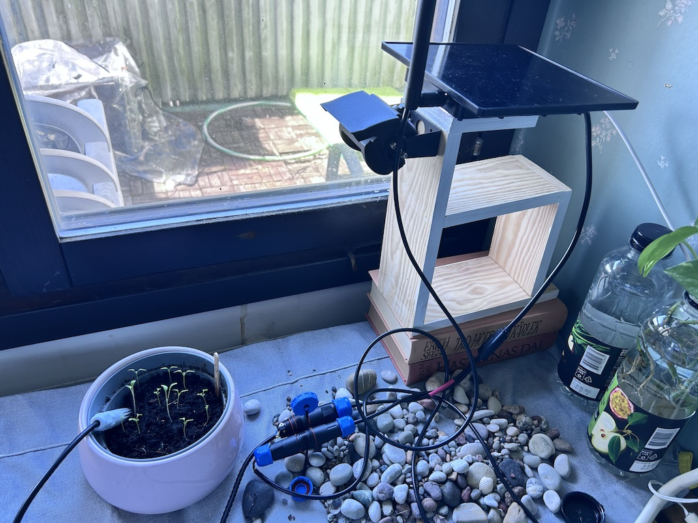
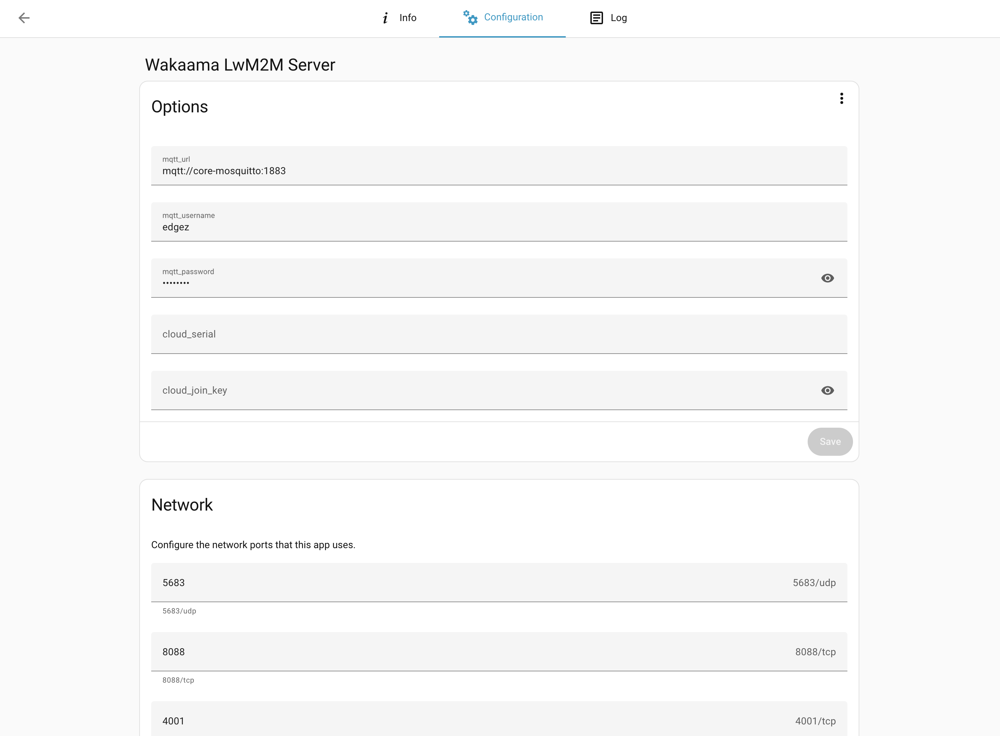
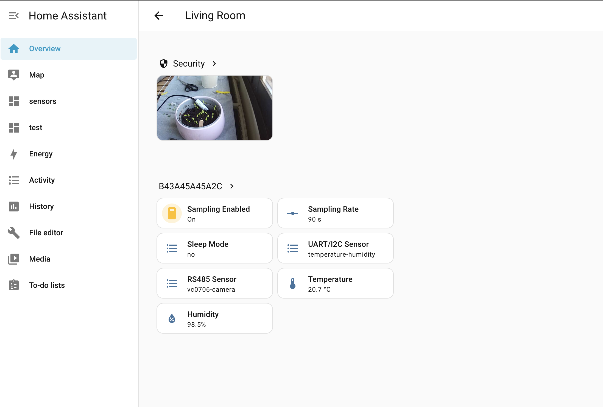

# home-assistant-addon

Home Assistant add-on repository for EdgeZ services.

## Screenshots

### Setup

### Configuration

### Demo

## Add-ons

- `wakaama-lwm2m-server/` - Runs the EdgeZ Wakaama LwM2M server.

### Wakaama add-on notes

- Current add-on `arch` supports both `aarch64` and `amd64`.
- For Home Assistant add-on networking, use the broker container hostname (typically `core-mosquitto`) instead of `homeassistant.local`.
- If MQTT username/password are set in add-on options and URL is empty, runtime default URL is `mqtt://core-mosquitto:1883`.
- Add-on options `cloud_serial` and `cloud_join_key` are supported and mapped to server args `--cloud-serial` and `--cloud-join-key`.
- When `cloud_join_key` is set, the server enables cloud mode.

## Supported Devices

This add-on works with **ESP32S3 series** edge devices. A notable device is the **Heltec HT-HC33**, which supports **Wi-Fi HaLow (802.11ah)** and can extend Home Assistant connectivity to **up to 1 km**.

### Wi-Fi HaLow Setup

To use Wi-Fi HaLow, a compatible **Wi-Fi HaLow access point** is required. Tested options include:

- [Halowlink2](https://www.halowlink.com)
- [Heltec HT-H7608](https://heltec.org)

Device firmware can be found at: [https://github.com/edgez-ai/edge-device-esp32](https://github.com/edgez-ai/edge-device-esp32)

## Sensor Driver System

This setup supports different types of sensors through its **sensor driver system**. Existing drivers can be found under [`wakaama-lwm2m-server/sensors/`](wakaama-lwm2m-server/sensors), organized by interface type:

- `sensors/rs485/` — RS-485 based sensors (e.g. flow sensor, power meter, camera)
- `sensors/uart_i2c/` — UART/I2C based sensors (e.g. PM2.5, temperature/humidity)

For driver development, refer to the EdgeZ Edge Device SDK: [https://github.com/edgez-ai/edge-device-sdk](https://github.com/edgez-ai/edge-device-sdk)

## Binary supply chain

The `lwm2mserver` binary in `wakaama-lwm2m-server/` is updated by the
`wakaama-server` CI workflow (arm64 and amd64 builds) and committed into this repository.
